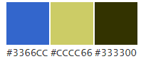
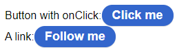
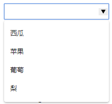
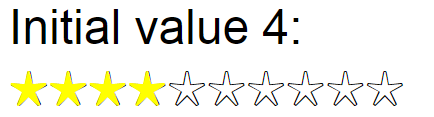
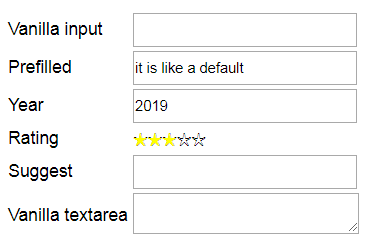
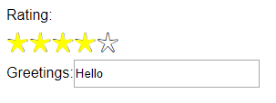

#### 色彩:

* 主 #3366CC
* 从 #CCCC66
* 辅 #333300



# Button

#### 【属性】:

|属性|类型|说明|
|---|---|---|
|href|string|跳转地址|
|onClick|func|点击按钮执行的回调函数|

#### 【应用举例】
```
<Button onClick={()=>{alert('ouch')}}>Click me </Button>			
<Button href="http://reactjs.com">Follow me </Button>
```

#### 【示意图】




# Suggest

#### 【属性】

|属性|类型|说明|
|---|---|---|
|options|[string]|选项列表|

#### 【方法】

|方法|说明|
|---|---|
|getValue()|当前选择的内容|

#### 【应用举例】

```
<Suggest options={['西瓜','苹果','葡萄','梨']} />		
```

#### 【示意图】




# Rating

#### 【属性】

|属性|类型|说明|
|---|---|---|
|defaultValue|number|默认评分|
|readonly|bool|是否只读|
|max|number|最大评分|

#### 【方法】

|方法|说明|
|---|---|
|getValue()|获取当前评价分数|
|setTemp(rating)|设置黄色星星显示个数|
|setRating(rating)|提交评价分数|
|reset()|将黄色星星显示个数复原为评价分数|

#### 【应用举例】

```
<Rating defaultValue={4} max={10}/>
```

#### 【示意图】




# FormInput

#### 【属性】

|属性|类型|说明|
|---|---|---|
|type|oneof(['year','suggest','rating','text','input'])|输入表单类型|
|id|string|--|
|options|[string]|suggest组件选项列表|
|defaultValue|any|默认值|

#### 【方法】

|方法|说明|
|---|---|
|getValue()|获取输入表单的值|


#### 【应用举例】

```
<table>
	<tbody>
		<tr>
			<td>Vanilla input</td>
			<td><FormInput/></td>
		</tr>
		<tr>
			<td>Prefilled</td>
			<td><FormInput defaultValue="it is like a default"/></td>
		</tr>
		<tr>
			<td>Year</td>
			<td><FormInput type="year"/></td>
		</tr>
		<tr>
			<td>Rating</td>
			<td><FormInput type="rating" defaultValue={4}/></td>
		</tr>
		<tr>
			<td>Suggest</td>
			<td><FormInput type="suggest" options={['red','green','blue']} defaultValue="green"/></td>
		</tr>
		<tr>
			<td>Vanilla textarea</td>
			<td><FormInput type="text"/></td>
		</tr>
	</tbody>
</table>
```

#### 【示意图】




# Form

#### 【属性】

|属性|类型|说明|
|---|---|---|
|fields|[{id:string(requied),label:string(requied),type:string,options:[string]}]|配置数据|
|initialData|{id:value}|默认值，id对应表单项目的id|
|readonly|bool|为Rating类型组件设置只读属性|

#### 【方法】

|方法|说明|
|---|---|
|getValue()|获取Form表单的值，返回一个data对象，data[id]存储对应id表单的值|

#### 【应用举例】

```
<Form	
	fields={[
		{
			label:'Rating',type:'rating',id:'rateme'
		},
		{
			label:'Greetings',id:'freetext'
		}
	]}
	
	initialData={{
		rateme:4,freetext:'Hello'
	}}
/>
```

#### 【示意图】




